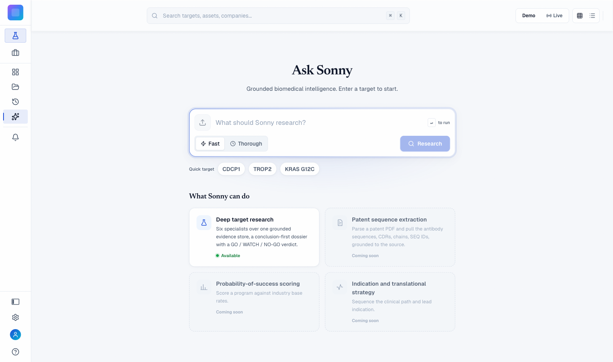
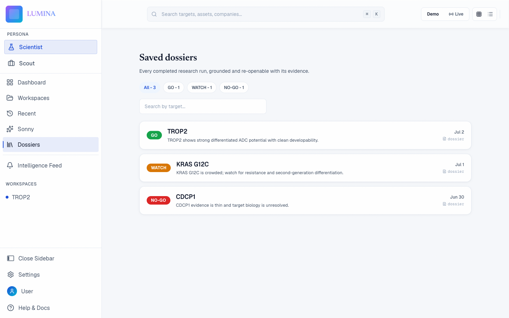
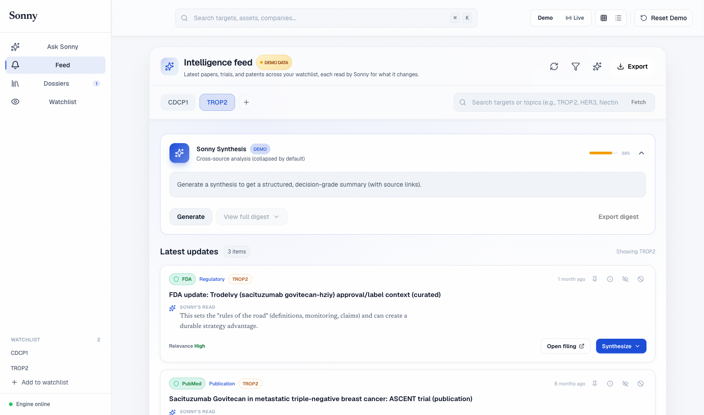

# LUMINA

**A biotech target/asset diligence dashboard with a grounded, glass-box research agent.**

LUMINA is the workspace where a skeptical scientist or BD/investment team asks a hard question about a drug target or asset and watches the reasoning happen. Its research agent, **Sonny**, runs live in front of you, streaming every source it reads and every inference it makes, then delivers a conclusion-first **GO / WATCH / NO-GO** dossier where each figure traces back to a real citation.

The product bet: for high-stakes biotech decisions, a transparent reasoning trace and disciplined citations beat a confident black-box answer.



## What it does

- **Ask Sonny.** A research composer takes a target or asset question and runs a grounded deep-research pass.
- **Glass-box trace.** The agent's reasoning streams live over server-sent events. You see the sources, tool calls, and intermediate findings as they happen, not just the final answer.
- **Conclusion-first dossiers.** Output leads with a GO / WATCH / NO-GO verdict, then the drivers, uncertainties, and triggers beneath it. Every claim carries a reference; the header shows the grounding ("Grounded / N refs").
- **Dossier library.** Completed dossiers are saved, searchable, and re-openable, each card showing its reference count.
- **Watchlist + Intelligence Feed.** Track targets and assets and get a monitored feed of new literature, trials, and filings, distilled into digests.
- **Investment memo + PDF export.** Turn a dossier into a shareable memo.





## Architecture

LUMINA is a Vite/React front end over an Express backend. The interesting part is the **Sonny seam**:

- The Sonny research engine ships as a set of published packages (`@mrsirquanzo/sonny-core`, `sonny-mcp-gateway`, `sonny-shared`).
- LUMINA's backend runs the engine **in-process inside a Node worker thread**, not as a separate service.
- The engine emits `TraceEvent`s over a `MessagePort`, which LUMINA republishes over its own SSE endpoint. That single event stream *is* the glass-box feed the UI renders.

The result is a live reasoning view with no extra network hop and no separate deep-research service to operate. Retrieval is handled through an MCP (Model Context Protocol) tool layer; see `docs/mcp/`.

```
Browser (React)  ──SSE──►  Express backend  ──MessagePort──►  Sonny engine (worker thread)
     ▲                          │                                    │
     └────── dossier JSON ──────┘                          MCP retrieval tools
```

## Tech stack

- **Frontend:** React 19, TypeScript, Vite, React Router, Tailwind CSS, TanStack Query, Zustand, Framer Motion
- **Backend:** Express (local dev/runtime), Vercel serverless functions (deployed API)
- **Agent/LLM:** Anthropic Claude, Google Gemini, Perplexity, orchestrated through the Sonny engine + MCP tools
- **Testing:** Vitest

## Running it

> **Note on access:** the Sonny engine (`@mrsirquanzo/sonny-*`) is published to a private GitHub Packages registry. This repository is source-available as a portfolio and reference piece; running the full research stack requires access to those packages plus your own LLM API keys. The front end and app shell are fully browsable regardless.

```bash
npm install                 # requires a GITHUB_PACKAGES_TOKEN for @mrsirquanzo/* deps
cp .env.example .env        # then fill in your API keys
npm run dev:all             # frontend + backend together
```

- Frontend: `http://localhost:5173` (Vite)
- Backend: `http://localhost:3001` (Express; required for Sonny/agents)

See `docs/getting-started/START_GUIDE.md` and `docs/getting-started/API_SETUP.md` for details.

## Repository layout

- `src/` — React app (dashboard, Sonny composer, glass-box trace, dossiers, Intelligence Feed)
- `server/` — Express backend and the Sonny worker seam
- `api/` — Vercel serverless functions (deployed API)
- `lib/` — shared client/agent logic
- `docs/` — architecture, MCP, getting-started, and deployment notes
- `content/` — MDX write-ups (projects, case studies)

## Documentation

- **Getting started:** `docs/getting-started/`
- **Architecture:** `docs/architecture/ARCHITECTURE_REVIEW.md`, `docs/architecture/CITATION_PROTOCOL_IMPLEMENTATION.md`
- **Retrieval (MCP):** `docs/mcp/`
- **Design system:** `docs/design/SONNY_DASHBOARD_DESIGN.md`
- **Deployment:** `docs/deployment/`

## License

[MIT](LICENSE) © 2026 Quan Ho
